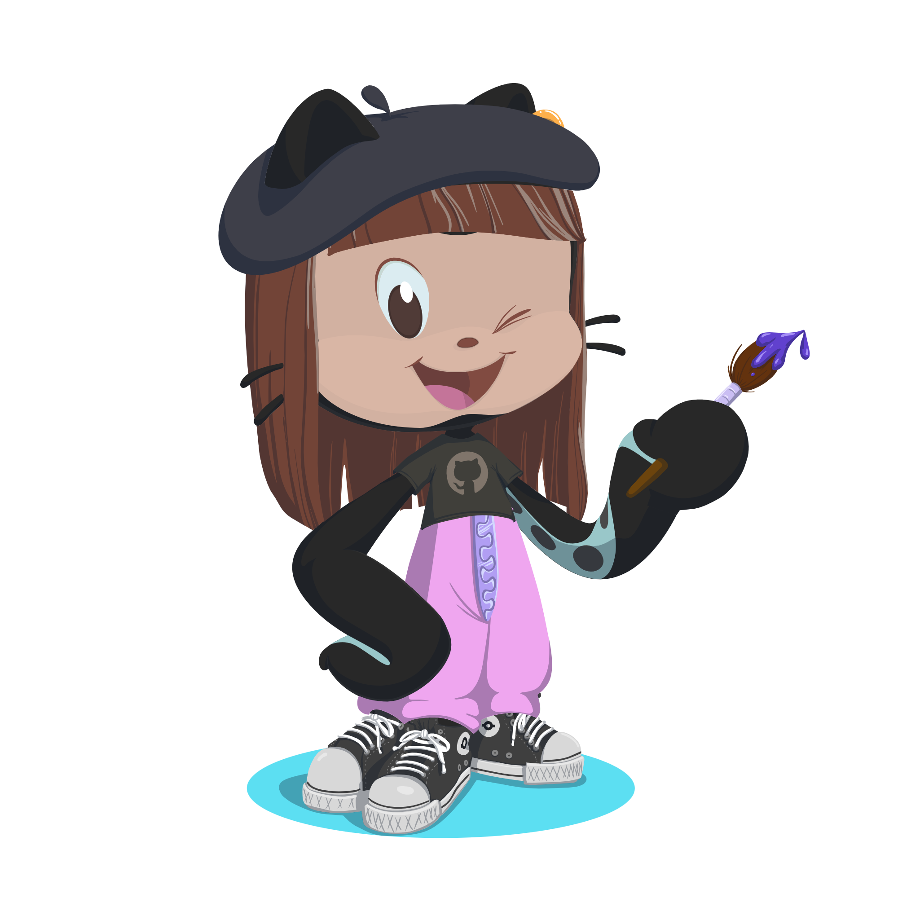

<h1 align="center">Hola, soy Nataly!  </h1>

  

## 👨🏻‍💻 &nbsp;Sobre mi
<pre>
💻 Soy desarrolladora Web, Diseñadora gráfica y Diseñadora UX/UI
📚 Tengo licenciatura de Informática en la Universidad Mayor de San Andrés
💛 Estudiante de Laboratoria en Desarrollo Web
🌟 Principales lenguajes: JavaScript y Typescript
🌱 Actualmente aprendiendo NodeJs
📝 Me gusta explorar nuevas tecnologias y soluciones para el desarrollo de software
🌤  Entusiasta del aprendizaje
✨ Amante de la pintura, los videojuegos, peliculas y la música
⚡ Fun fact: karaokelover 🤩
🤔 Actualmente abierta para: una nueva <b>oportunidad de trabajo</b> en desarrollo 
</pre>

## 🛠️ &nbsp;Mis Skills

### 💬 Programming Languages
&nbsp;
&nbsp;

### 🎴 &nbsp;FrontEnd 
&nbsp;
&nbsp;
&nbsp;

### 📊 &nbsp;Backend
&nbsp;
&nbsp;
 
### 🗃 &nbsp;Databases
&nbsp;
&nbsp;
&nbsp;
&nbsp;
&nbsp;

### ✅ &nbsp;Testing
&nbsp;
&nbsp;

### 👯‍♂️ &nbsp;Version Control
&nbsp;
&nbsp;
&nbsp;

### 🧰 &nbsp;Tools
&nbsp;
&nbsp;
&nbsp;
&nbsp;
&nbsp;
&nbsp;
&nbsp;
&nbsp;
&nbsp;
&nbsp;

### 📥 &nbsp;Hosting
&nbsp;
&nbsp;

### ✒ &nbsp;Graphic Design
&nbsp;
&nbsp;
&nbsp;
&nbsp;
&nbsp;

### 📈 &nbsp;Git Stats

  
  

 

  

  <ul align="center">
    
<h2 style="display: inline-block">Connect With Me🤝</h2>

  </ul>

<!--icons and links-->

 

  <h3><b>📍 Profile Visitor Count</b></h3>

<!-- retro visitor counter -->  

   
    

   
  
  
    
<!-- retro visitor counter -->  

  

